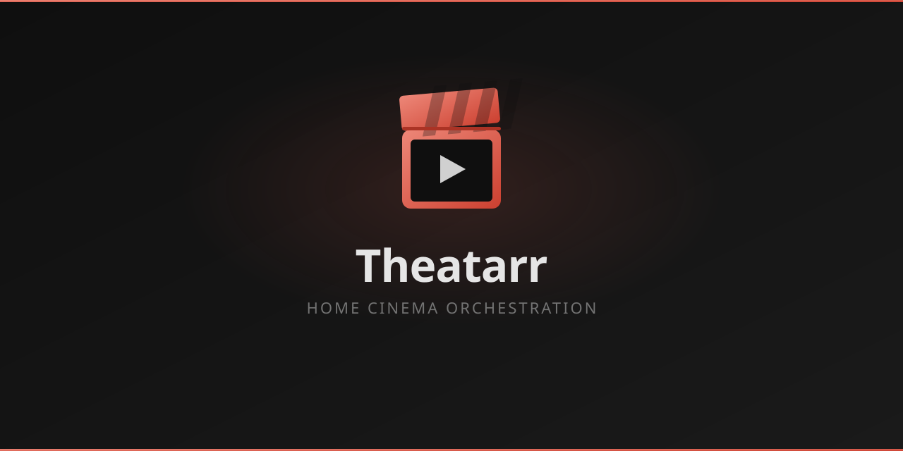
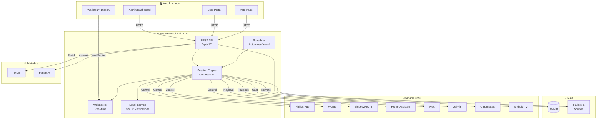
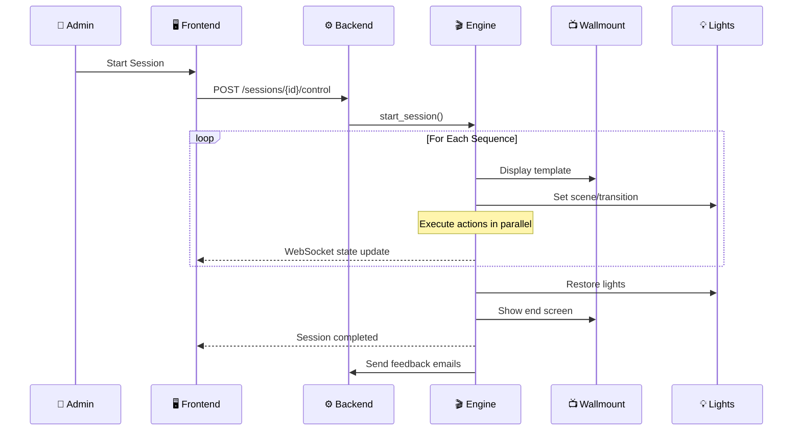
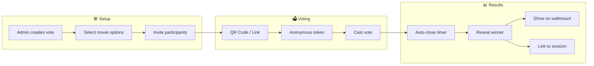

<div align="center">



<br/><br/>

[](https://github.com/jeremie/theatarr/releases)
[](LICENSE)

[](https://python.org)
[](https://fastapi.tiangolo.com)
[](https://reactjs.org)
[](https://typescriptlang.org)
[](https://sqlite.org)

<!--  -->

**[Quick Start](#-quick-start)** •
**[Features](#-features)** •
**[Integrations](#-integrations)** •
**[Architecture](#-architecture)** •
**[Screenshots](#-screenshots)**

</div>

---

## 🚀 What is Theatarr?

Theatarr is a **home cinema orchestration system** that synchronizes your lighting, audio, media playback, and on-screen displays to create a fully automated movie theater experience at home.

Design cinema sessions with timed sequences — dim the lights, play trailers, display a countdown on your TV, start the movie on Plex, then bring the lights back up when it's over. All orchestrated from a single web interface.

**Perfect for:**
- 🏠 Home theater enthusiasts who want the full cinema experience
- 🎬 Movie night organizers who host friends & family
- 💡 Smart home owners with Hue, WLED, or Zigbee lights
- 📺 Plex/Jellyfin users who want more than just "press play"

---

## ✨ Features

<table>
<tr>
<td width="33%" valign="top">

### 🎬 Session Orchestration
**Create cinematic experiences**
- Multi-sequence session design
- Parallel action execution
- Real-time session control
- Pause, resume, skip, stop
- Participant management
- Feedback & rating system

</td>
<td width="33%" valign="top">

### 💡 Smart Lighting
**4 lighting integrations**
- **Philips Hue** - Scenes & transitions
- **WLED** - LED strip effects
- **Zigbee2MQTT** - Group control
- **Home Assistant** - Webhooks
- Smooth fade-in / fade-out
- Color temperature control

</td>
<td width="33%" valign="top">

### 📺 Wallmount Display
**37 built-in templates**
- Live countdown timers
- Movie poster & metadata
- Dynamic color theming
- Ken Burns animations
- Glassmorphism, neon, retro
- Custom HTML/CSS/JS support

</td>
</tr>
</table>

<table>
<tr>
<td width="33%" valign="top">

### 🗳️ Voting System
**Let your guests choose**
- Token-based anonymous voting
- QR code link sharing
- Auto-open / auto-close scheduling
- Live results on wallmount
- Session-linked vote resolution

</td>
<td width="33%" valign="top">

### 🎥 Trailer Management
**Automated downloads**
- YouTube trailer auto-download
- Quality & storage rules
- Pre-roll sequencing
- Trailer library browsing

</td>
<td width="33%" valign="top">

### 🧩 Quiz System
**Interactive entertainment**
- Movie trivia quizzes
- Real-time scoring
- Participant tracking
- Results display

</td>
</tr>
</table>

### 🌐 Portal & Notifications
- **User portal** — Guests see their invitations, votes, and session history
- **Email notifications** — SMTP integration with 6 notification types
- **Real-time WebSocket** — Live session state updates for all connected clients
- **Mobile responsive** — Full experience on phone, tablet, or kiosk display

### 🎨 Enrichment & Theming
- **TMDB** integration for movie metadata, cast, genres, ratings
- **Fanart.tv** for HD logos, artwork, and backdrops
- **Automatic color extraction** from movie posters (primary, accent, vibrant)
- **Dynamic template theming** based on extracted colors

---

## 🔌 Integrations

<table>
<tr>
<th>Category</th>
<th>Service</th>
<th>Description</th>
</tr>
<tr><td rowspan="4"><b>💡 Lighting</b></td>
<td>Philips Hue</td><td>Scenes, transitions, entertainment mode (REST API v2)</td></tr>
<tr><td>WLED</td><td>Addressable LED strips, effects, presets</td></tr>
<tr><td>Zigbee2MQTT</td><td>Zigbee devices via MQTT with group support</td></tr>
<tr><td>Home Assistant</td><td>Webhook-based integration for any HA entity</td></tr>
<tr><td rowspan="2"><b>📺 Media</b></td>
<td>Plex</td><td>Library browsing, metadata, streaming</td></tr>
<tr><td>Jellyfin</td><td>Open-source media server integration</td></tr>
<tr><td rowspan="2"><b>🎮 Players</b></td>
<td>Chromecast</td><td>Google Cast protocol for media playback</td></tr>
<tr><td>Android TV</td><td>ADB remote control for Google TV / Android TV</td></tr>
<tr><td rowspan="2"><b>📊 Metadata</b></td>
<td>TMDB</td><td>Movie data, cast, genres, ratings, images</td></tr>
<tr><td>Fanart.tv</td><td>HD logos, clearart, backdrops, posters</td></tr>
</table>

> **Extensible architecture** — New adapters can be added by implementing the `ServiceAdapter` base class and registering with `@AdapterRegistry.register`.

---

## 🏃 Quick Start

### Prerequisites

- Python 3.11+
- Node.js 18+
- npm or yarn

### Backend

```bash
cd backend

# Create virtual environment
python -m venv venv
source venv/bin/activate

# Install dependencies
pip install -e .

# Run migrations
alembic upgrade head

# Start the server (port 2273)
python -m uvicorn theatarr.main:app --host 0.0.0.0 --port 2273 --reload --app-dir src
```

### Frontend

```bash
cd frontend

# Install dependencies
npm install

# Start dev server (port 2173)
npm run dev -- --host 0.0.0.0 --port 2173
```

### Access

| Interface | URL | Auth |
|-----------|-----|------|
| **Admin** | `http://localhost:2173` | `admin` / `adminadmin` |
| **Portal** | `http://localhost:2173/portal` | User credentials |
| **Wallmount** | `http://localhost:2173/display` | No auth (public) |
| **API Docs** | `http://localhost:2273/docs` | — |

---

## 🏗️ Architecture

### Global Architecture



### Session Orchestration Flow



### Voting Flow



---

## 📸 Screenshots

<details>
<summary><b>📊 Admin Dashboard & Sessions</b></summary>

<!-- | Dashboard | Session Editor | -->
<!-- |-----------|----------------| -->
<!-- |  |  | -->

*Screenshots coming soon*

</details>

<details>
<summary><b>📺 Wallmount Templates</b></summary>

37 built-in templates including:
- Fullscreen poster with countdown
- Split layout with movie info
- Neon retro style
- Glassmorphism design
- Cinema ticket style
- Elegant premium
- Minimal countdown
- Custom HTML/CSS/JS

<!-- | Poster Countdown | Neon Retro | -->
<!-- |------------------|------------| -->
<!-- |  |  | -->

*Screenshots coming soon*

</details>

<details>
<summary><b>🗳️ Voting & Portal</b></summary>

<!-- | Vote Page | Portal Home | -->
<!-- |-----------|-------------| -->
<!-- |  |  | -->

*Screenshots coming soon*

</details>

---

## 🔧 Configuration

### Environment Variables

| Variable | Default | Description |
|----------|---------|-------------|
| `SECRET_KEY` | *auto-generated* | JWT signing key |
| `DATABASE_URL` | `sqlite+aiosqlite:///data/theatarr.db` | Database connection |
| `DEBUG` | `false` | Enable debug mode |
| `VITE_API_URL` | `http://localhost:2273` | Backend URL (frontend) |

### Admin Settings

All settings are configurable from the web UI under **Settings**:

| Category | Settings |
|----------|----------|
| **General** | Frontend URL, language, debug mode |
| **Email** | SMTP host, port, credentials, security (STARTTLS/SSL) |
| **Enrichment** | TMDB API key, Fanart.tv API key |
| **Trailers** | Download quality, storage rules, auto-download |

---

## 🛠️ Technology Stack

| Layer | Technologies |
|-------|-------------|
| **Backend** | Python 3.11 • FastAPI • SQLAlchemy 2.0 • Alembic • Pydantic v2 |
| **Frontend** | React 18 • TypeScript 5 • Tailwind CSS • Vite 5 • React Query |
| **Real-time** | WebSockets • Server-Sent Events |
| **Data** | SQLite • Zustand • React Router 6 |
| **IoT** | MQTT (aiomqtt) • REST • Cast protocol • ADB |
| **Media** | yt-dlp • HLS.js • Pillow • colorthief |
| **Auth** | JWT (python-jose) • bcrypt |
| **Email** | aiosmtplib • HTML templates |

---

## 📁 Project Structure

```
├── backend/
│   ├── src/theatarr/
│   │   ├── adapters/       # Service integrations (Hue, Plex, etc.)
│   │   ├── api/            # FastAPI route handlers
│   │   ├── models/         # SQLAlchemy ORM models
│   │   ├── schemas/        # Pydantic validation schemas
│   │   ├── services/       # Business logic (engine, scheduler, email)
│   │   └── main.py         # Application entry point
│   ├── alembic/            # Database migrations
│   └── pyproject.toml
├── frontend/
│   ├── src/
│   │   ├── components/     # React components
│   │   ├── pages/          # Route pages
│   │   ├── stores/         # Zustand state stores
│   │   ├── api/            # API client
│   │   └── hooks/          # Custom React hooks
│   └── package.json
├── data/                   # SQLite database
├── assets/branding/        # Logo, icons, banners (SVG + PNG)
└── docs/                   # Technical documentation
```

---

## 📡 API Reference

The backend exposes a comprehensive REST API at `/api/v1`:

| Endpoint | Description |
|----------|-------------|
| `POST /auth/login` | JWT authentication |
| `GET /sessions` | List cinema sessions |
| `POST /sessions/{id}/control` | Start, pause, stop session |
| `GET /vote-sessions` | List vote sessions |
| `POST /vote/{token}` | Cast an anonymous vote |
| `GET /movies/search` | Search movies (TMDB) |
| `GET /templates` | List wallmount templates |
| `GET /wallmount/state` | Current display state (public) |
| `GET /services/adapters` | Available adapter types |
| `GET /portal/sessions` | User's sessions (portal) |
| `WS /ws?token=...` | Real-time WebSocket |

Full interactive documentation available at `http://localhost:2273/docs` (Swagger UI).

---

## 📦 Data & Backup

### Export / Import

Theatarr supports full configuration export including:
- Sessions with sequences and actions
- Service configurations (encrypted credentials)
- Templates and trailer rules
- Application settings

Available from **Settings > Import / Export** in the admin UI.

### Database

| Path | Content |
|------|---------|
| `data/theatarr.db` | SQLite database (sessions, users, settings) |
| `data/trailers/` | Downloaded trailer files |
| `data/sounds/` | Custom sound library |

---

## 🤝 Contributing

Contributions are welcome! Please:

1. Fork the repository
2. Create a feature branch (`git checkout -b feature/amazing-feature`)
3. Make your changes
4. Run the backend: `cd backend && source venv/bin/activate && python -m uvicorn theatarr.main:app --reload --app-dir src`
5. Run the frontend: `cd frontend && npm run dev`
6. Submit a pull request

---

## 📄 License

This project is licensed under the MIT License — see the [LICENSE](LICENSE) file for details.

---

<div align="center">

**[⬆ Back to top](#)**

Made with ❤️ for home cinema enthusiasts

</div>
